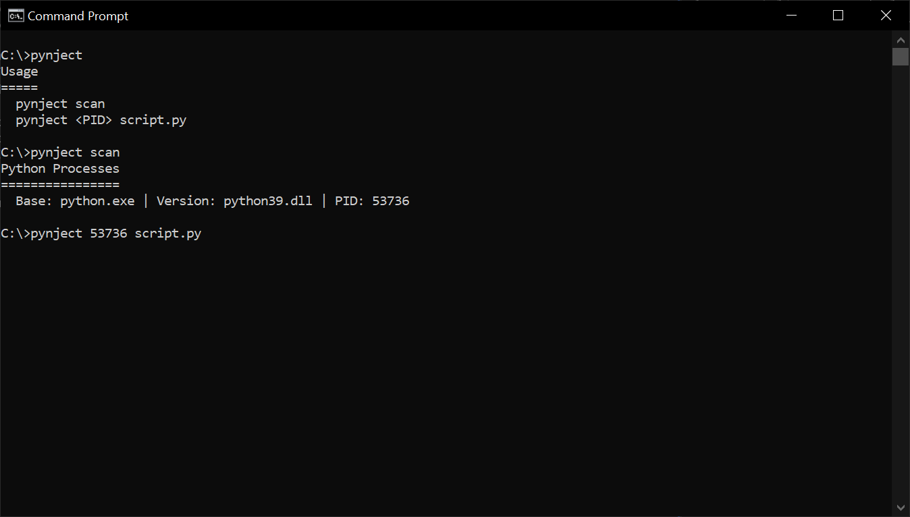

<br><br>
A Windows application for injecting code into live python processes. What makes Pynject different from other injectors is that it does not rely on GDB to do the heavy lifting. Pynject scans the system for running python processes, and uses DLL injection to run code using the Python C API.
<br>

## Installation & Usage
Pre-compiled binaries for x64 and x86 systems can be downloaded from the [releases](https://github.com/am-nobody/pynject/releases) page. It is strongly recommended that you [add pynject to your PATH](https://www.architectryan.com/2018/03/17/add-to-the-path-on-windows-10/) for ease of access.
### <ins>Building from Source</ins>
Download and install [Visual Studio](https://visualstudio.microsoft.com/) if you have not already.
Open the project file in the 'src' directory. Build both solutions for your target architecture, and ensure that 'executor.dll' is in the same directory as pynject before execution.
### <ins>Usage</ins>
Pynject has two functions. To scan your system for running python processes, use the scan command.
```
C:\>pynject scan
Python Processes
================
  Base: python.exe | Version: python39.dll | PID: 53736
```
To inject a sript, pass both the process PID and a path to your script as arguments.
```
C:\>pynject 53736 script.py
```
<br>

## Pynject Standard Payloads
Pynject comes bundled with pre-written scripts which you may find useful. Documentation for these payloads can be found [here](https://github.com/am-nobody/pynject/tree/master/docs/payloads). The current list official payloads is as follows.
* Pynject Executor
<br><br>

## Contributing
All contributions are welcome so long as whatever you've done is functional. Payload contributions are especially desired!
<br><br>

## The Future
Pynject is still in its infancy, plenty of ideas are in the works if motivation sticks around. I want to support different platforms in the future as well.

<ins>Currently in Development</ins>
```
Pynject Inspector

 - Inspect and change global variables.
 - View class methods & attributes.
 - View function instructions and arguments.
```
<br>

## Credits
Developed and maintained by am-nobody.<br>
Inspired by lmacken's [pyrasite](https://github.com/lmacken/pyrasite) & contributors.
