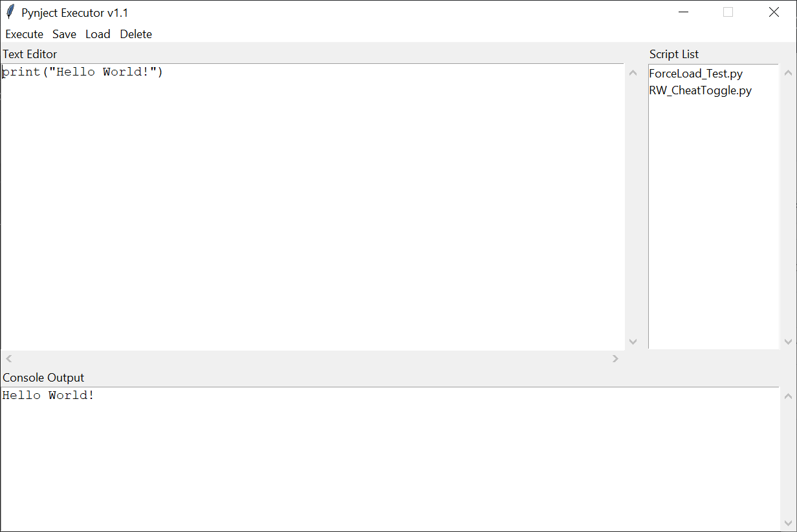

*The Pynject Executor is a GUI application for developing and executing scripts within a target python process.*
<br><br>

## Execution & Cleanup
When injected the executor will only load if it will not be polluting the target's namespace. Stdout and Stderr are redirected to the output console. The pynject executor will execute in a separate thread to allow more code to be executed through Pynject simultaneously. Upon exiting the GUI, the executor will remove all imports that weren't there upon its launch. It will then remove its own globals from the target's namespace and restore Stdout and Stderr.
<br><br>

## Script Development
The first thing to note when developing scripts to be run through the executor is that unlike through Pynject, your script will not be run in the global scope. Instead you will need to declare any globals you intend to modify beforehand.

```
# Wrong
variableToChange = "I will not throw an exception, but I have not changed!"

# Right
global variableToChange
variableToChange = "Now I am changed!"
```
<br>
The pynject executor has some built in functions which can be useful in your scripts.

* cls() - Clear output console.
* cout(str) - Print to output console.
* copy(str) - Use this rather than copying from outputconsole.
* fglobals() - Returns globals() with the executor's own globals filtered.
* force_load(str) - Forces a module to load from out of path scope.
* find_objects(str) - Find tracked objects of specified type. Returns dict with format {symbol: value}.
<br><br>
### force_load()
This function works quite differently. To use it, you need the target application's python version installed on your system as well as the module you're trying to load. The function will spawn a subprocess using that version of python and find the location of the module. __Do not use this function unless the target's path is restricted. (e.g. pyinstaller)__
<br><br>

## Script Storage
Scripts are stored and can be accessed across sessions of the executor. Scripts are saved in the following directory.
```
%LOCALAPPDATA%/pynject/executor
```