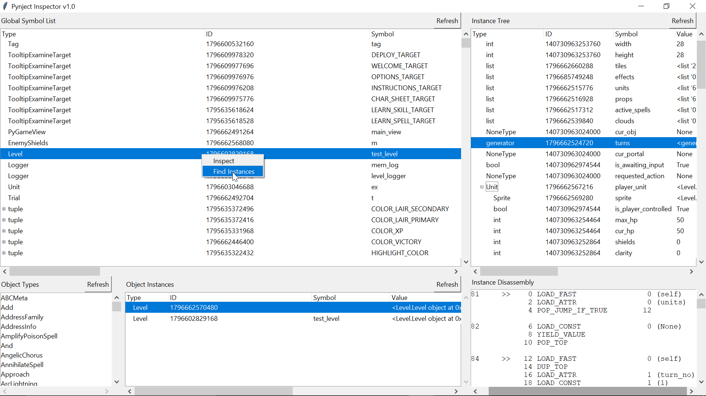

*The Pynject Inspector is a GUI application exploring objects within a target process.*
  

# Panes
The inspector window is composed of five smaller panes. The global symbol tree, object types list, object instance tree, inspector instance tree, and the instance disassembly output.
  

### Global Symbol Tree
The global symbol tree will be populated when the program starts. It contains every object mapped to a symbol visible in the global scope. You can right click any object to inspect it or find other instances of the same type.
  

### Object Types & Instances
The object type list is a list of all the types of objects currently tracked by the garbage collector. These can be right clicked to find instances of that type. The instance tree lists all instances of the specified type, and the corresponding symbol if it is known.
  

### Instance Tree & Disassembly
The instance tree is populated when you right click an object and press inspect. Initially the top-level children of the instance will be displayed, but more ancestors can be accessed by right clicking any member and pressing enumerate. The disassembly output box can be filled by right clicking an object of a compatible type in the instance tree, and then pressing disassemble.
  

# Tree Population
Reading the tree output is very easy once you understand how each type is parsed. Simple data such as strings, integers, and booleans are just plopped onto the tree. Iterables are parsed into a parent and children. Lists will have children with no symbol attribute. Dictionaries will have children with the key being the symbol. Functions and methods will have their arguments as the value. Classes are displayed as simple data, but can be broken down in the inspector tree.
  
TTK treeview columns are quite finicky. You will probably want to keep the GUI windowed to adjust the column sizes. If you cannot see the full value column, drag the end of it off screen.